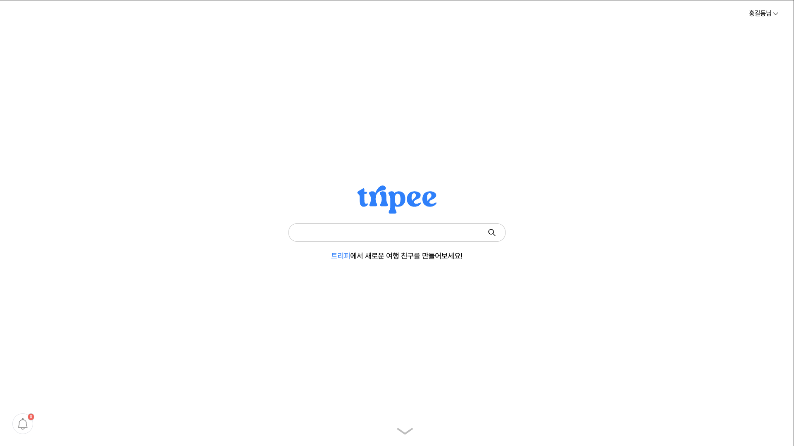
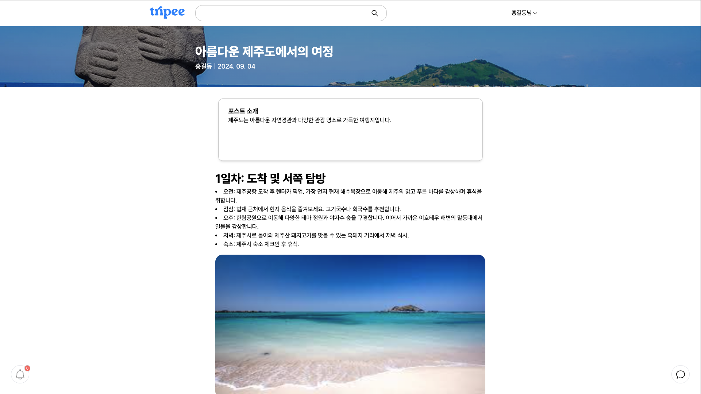

# Tripee

여행 공유 플랫폼

## [Demo](https://winkathon-tripee.vercel.app/)

## Team

| 학번       | 이름                                       | 분야                                                                                                            |
|----------|------------------------------------------|---------------------------------------------------------------------------------------------------------------|
| 20223051 | [권세건](https://github.com/honeybugs)      |  |
| 20212992 | [박건민](https://github.com/pkm021118)      |  |
| 20212967 | [김문기](https://github.com/Kimmoongi0320/) |    |
| 20243156 | [손대현](https://github.com/son-daehyeon)   |    |

## Tech Stack

### Frontend

### Backend

## [Design (Figma)](https://www.figma.com/design/Bxke3mPYFjN7D2HG906arH/tripee?node-id=18-83&t=BjPfJw7ZGMU7jXUb-0)

## Features

- 여행 게시하기 (무료 / 유료)
- 여행 검색
- 여행 보기
  - 결제 시스템
- 여행 찜하기
- 여행 댓글 작성 및 보기

## [Presentation](/presentation/README.md)

## Screenshots

## Acknowledgements

- [Toss Payments API](https://docs.tosspayments.com/reference)
